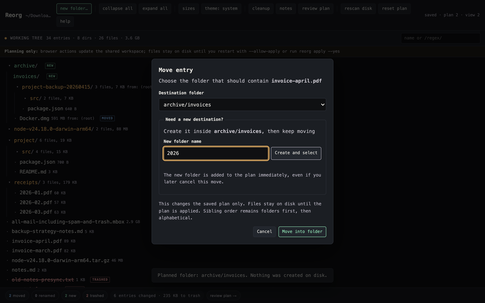

# Reorg

Reorganize a directory yourself in the browser, or collaborate with an AI agent in real time on the same plan. Reorg validates every operation and leaves the filesystem untouched until you explicitly apply; when an agent joins, the scanned tree, proposed changes, and UI state become shared context that you can see and steer.

```
npx reorg-cli@latest ~/Downloads
```

That scans the directory, opens the planner in your browser, and prints a URL. You can select an entry to see its labeled actions, create folders at any level, move with or without drag and drop, rename things, and mark junk for trash. The browser and CLI are complete on their own; no AI agent is required. With the [Agent Skill](#collaborate-with-an-ai-agent) installed, you can instead ask your agent to propose or make those changes while you watch, review, and redirect the same plan. No planned rename, move, folder, or trash action touches the entries on disk until you say so.

> Help me organize `~/Downloads` with Reorg. Start by showing me what you would change, then keep the browser in sync as we work through it together.


When a destination does not exist yet, create and select it without leaving Move. Repeat that step to build as much nested structure as the plan needs.



No runtime dependencies, no build step, no config file. One Node script and a page.

The architecture and the tradeoffs behind those constraints are documented in [DESIGN.md](DESIGN.md).

## Why

Cleaning up a directory has two distinct parts: deciding what its shape should be, and safely realizing that plan on disk. An AI agent can accelerate the first part only when you and the agent can see the same state, build on each other's decisions, and catch stale or conflicting intent. Reorg provides that shared, revisioned planning surface, then compiles the agreed plan into ordered filesystem operations for applying and undoing the changes, with collisions caught before anything moves.

This makes the agent a collaborator rather than a black-box file mover. It can understand contents, propose structure, update the plan, and focus the browser on what it is discussing; Reorg remains responsible for state, validation, attribution, dry runs, application, and recovery.

It is useful for a `~/Downloads` that got away from you, a repo whose layout no longer matches how you think about it, or a scratch directory you have been meaning to triage for a year.

## Install

Install globally to add the `reorg` command:

```bash
npm install -g reorg-cli
reorg ~/Downloads
```

For a one-off run, use the latest release without installing a persistent command:

```bash
npx reorg-cli@latest ~/Downloads
```

npm may cache the downloaded package, but `reorg` is not available as an installed command afterward. To run from a source checkout, clone and link it:

```bash
git clone https://github.com/j-256/reorg
cd reorg
npm link
reorg ~/Downloads
```

Requires Node 22 or newer – the oldest release still receiving security updates. There are no runtime dependencies: `package.json` has an empty `dependencies` block and that is deliberate.

## Tests

```bash
npm test        # no install needed -- runs on a bare checkout
npm run test:ui # browser tests; needs `npm ci` and a Chromium
npm run test:all
```

`npm test` uses Node's built-in test runner and needs nothing installed. Browser and accessibility tests use Playwright and axe-core from `devDependencies`:

```bash
npm ci && npx playwright install chromium
```

See [DESIGN.md](DESIGN.md#testing-strategy) for the boundaries between pure resolver tests, filesystem integration tests, and browser tests.

## Using it

| Command | What it does |
|---|---|
| `reorg [dir]` | scan, serve the planner, open a browser |
| `reorg [dir] --allow-apply` | enable confirmation-protected browser apply for this server session |
| `reorg [dir] --static` | write and open a self-contained planner with no server |
| `reorg plan [dir]` | print the current plan as operations |
| `reorg apply [dir]` | dry run: print what would happen, change nothing |
| `reorg apply [dir] --yes` | apply, writing an undo script first |
| `reorg apply --plan FILE` | dry-run a plan exported by a static planner |
| `reorg undo [dir]` | run the most recent undo script |
| `reorg status [dir]` | what is planned, applied, and undoable |
| `reorg inspect [dir] --json` | return the frozen scan, semantic plan, shared view, effective presentation, and resolved operations |
| `reorg rescan [dir] --json` | refresh the canonical frozen scan without changing source files |
| `reorg mutate [dir] --input FILE` | apply revision-checked semantic plan commands |
| `reorg view [dir] --input FILE` | update filters, collapse state, selection, and side-panel state |
| `reorg view [dir] --focus ID` | reveal and select one stable node id |
| `reorg schema` | print the machine-readable collaboration contract |
| `reorg state move DEST --data-dir SOURCE` | relocate a stopped workspace data directory |
| `reorg state rebind NEW_ROOT --data-dir DIR` | validate and bind state to a relocated source directory |
| `reorg summarize [dir]` | one-line AI description per file (see below) |
| `reorg triage [dir]` | rank likely-disposable entries and say why |
| `reorg --version` | print the installed reorg version |

Short aliases are `-c` for `--collapse-over`, `-d` for `--data-dir`, `-e` for `--emit-prompts`, `-f` for `--force`, `-i` for `--ingest`, `-j` for `--json`, `-l` for `--limit`, `-m` for `--model`, `-o` for `--output`, `-p` for `--port`, `-s` for `--static`, `-y` for `--yes`, `-v` for `--version`, and `-h` for `--help`. Safety controls, negations, collaboration metadata, and collision siblings stay long-only; in particular, `--plan` stays long-only so `-p` is unambiguously the port.

In the planner:

- **Select** a row to expose Rename, Move, New folder, Add note, and Trash or Remove actions with plain-language labels.
- **Create folders** from the always-visible New folder button, then choose both the name and containing folder explicitly.
- **Move** an entry with the Move dialog. If the destination is missing, create and select it in place, then repeat to build nested destinations.
- **Drag** a row onto a folder's middle to move *into* it; onto the top or bottom edge to become a sibling. Drop below the tree to move to the top level.
- **Use Arrow keys, Home, and End** to navigate the tree, `Enter` or `Space` to select or preview, and `Shift+F10` to open the selected entry's action menu.
- **Double-click** or press `F2` to rename in place.
- **Press `Delete`** to mark an entry for trash. Folders take their contents with them.
- **Press `n`** to open New folder inside a selected folder, alongside a selected file, or at the top level when nothing is selected.
- **Press `N`** to attach a note.
- **Press `/`** to jump to the filter box; wrap the query in slashes for a regex (`/\.log$/`). Invalid expressions are explained without hiding the tree.
- **Press `?`** to list every key.

Toolbar toggles persist in shared view state, so the view you set up is the view the browser, CLI, and an AI agent can inspect: **git status** tints rows by git status, **sizes** draws a size bar on each row, and **theme** cycles `system` through forced `dark` and `light`.

Sibling order is *derived* (folders first, then natural sort), never stored. Dragging something out of a folder and back is a genuine no-op rather than a phantom "reordered" change.

The planner targets WCAG 2.2 AA overall and adds AAA enhancements where they improve the experience without changing the product's compact structure. Normal and large text meet the AAA enhanced contrast thresholds in both themes, while controls meet the AA minimum target size rather than the larger AAA target. The tree, menus, dialogs, panels, status messages, focus movement, narrow single-pane layout, and reduced-motion behavior are all covered by browser tests.

## Collaborate with an AI agent

Reorg turns directory organization into a shared session. The browser and agent use one authoritative workspace, and the browser watches its revisions so each collaborator sees the other's plan and view changes in real time. Shared filters, collapsed folders, selection, and side-panel context let the agent answer "what is Reorg displaying?" and focus the interface on the entry it is discussing.

The browser submits semantic commands through the token-gated server API. An agent submits the same command vocabulary through `reorg mutate` and `reorg view`; it never edits a state file directly. Both paths reach the same revision-checked command layer, stale intent becomes a visible conflict instead of an overwrite, and source paths remain unchanged until an explicitly authorized apply runs.

The source checkout includes one canonical [Reorg Agent Skill](.agents/skills/reorg/SKILL.md). Codex discovers it from `.agents/skills`, while Claude Code discovers the same folder through `.claude/skills`. Invoke `$reorg` in Codex or `/reorg` in Claude Code to inspect or organize a directory through the shared workspace.

The Skill is instruction-only. It selects the first compatible CLI by checking `reorg schema --json`: the source-checkout command, an installed `reorg`, then `npx --yes reorg-cli@latest`. The `npx` fallback may populate npm's cache but does not install a global command. Every deterministic state transition remains in Reorg's revisioned CLI.

The collaboration model, concurrency contract, and decision not to add an MCP adapter are documented in [DESIGN.md](DESIGN.md#agent-integration).

To install the Skill globally without cloning the repository, download its single canonical file into the personal Skill directory for your agent:

For Codex:

```bash
mkdir -p "$HOME/.agents/skills/reorg"
curl -fsSL "https://raw.githubusercontent.com/j-256/reorg/main/.agents/skills/reorg/SKILL.md" -o "$HOME/.agents/skills/reorg/SKILL.md"
```

For Claude Code:

```bash
mkdir -p "$HOME/.claude/skills/reorg"
curl -fsSL "https://raw.githubusercontent.com/j-256/reorg/main/.agents/skills/reorg/SKILL.md" -o "$HOME/.claude/skills/reorg/SKILL.md"
```

Claude Code users can instead install the Skill as a user-scoped plugin, which gives it the namespaced `/reorg:reorg` command and marketplace updates:

```bash
claude plugin marketplace add j-256/reorg
claude plugin install reorg@reorg --scope user
```

Use either the direct Claude Code installation or the plugin installation so Claude does not load the same workflow twice. Installing `reorg-cli` globally remains useful for the bare `reorg` command and avoids the `npx` startup path, but the Skill does not require it.

### Workspace portability

By default the workspace lives in `<root>/.reorg`. Put it elsewhere when the planning data should travel independently:

```bash
reorg ~/Downloads --data-dir ~/reorg-data/downloads
reorg inspect --data-dir ~/reorg-data/downloads --json
```

An external data directory must be outside the reorganized root. Its own path is not embedded, so moving only that data does not require rebinding:

```bash
reorg state move ~/archive/reorg-downloads --data-dir ~/reorg-data/downloads
```

Stop the browser server before moving or copying workspace data; a live server lease makes `state move` and `state rebind` refuse rather than split the source of truth. If the source directory itself moves, rebind after the move. Rebind compares relative ids, entry kinds, sizes, collapsed-directory totals, and link targets against the frozen scan before changing the binding; a truncated scan is refused because it cannot validate the whole displayed baseline:

```bash
reorg state rebind /Volumes/Archive/Downloads --data-dir ~/archive/reorg-downloads
```

Apply recovery is deliberately not portable workspace data. Undo scripts, staging, and trashed entries always stay in `<root>/.reorg` beside the filesystem they can restore, even when `--data-dir` points elsewhere. Moving the default workspace splits out its portable files and leaves those recovery artifacts in place; moving it back merges the portable files without disturbing recovery.

After `reorg undo`, the CLI refreshes any workspace found at the selected `--data-dir`, and a running browser adopts that scan. Pass the external data directory when undoing a source whose portable workspace does not live at the default path.

## Static planner

Use `--static` when the planner needs to work without a local HTTP server:

```bash
reorg ~/Downloads -s
reorg ~/Downloads -s -o downloads-plan.html
```

Without `--output`, Reorg writes a temporary HTML file and opens it. The page is self-contained: the tree, cleanup candidates, bounded file previews, styles, and browser code are all embedded, so it can be moved and opened directly with a `file://` URL. An explicit output path is never overwritten.

The tradeoff is that a static page cannot rescan the directory, autosave to the shared workspace, check the live filesystem, or apply anything. Edits stay in the page until **Review plan** exports `reorg-plan.json` by download or clipboard. Feed that export back to the CLI:

```bash
reorg apply --plan ~/Downloads/reorg-plan.json # drift-checked dry run
reorg apply --plan ~/Downloads/reorg-plan.json --yes # write undo script, then apply
```

The export carries the plan, the scan it was drawn against, and the effective view, including the source root. That lets the CLI preserve every intended operation and refuse the batch if a source disappeared or a destination became occupied. Pass an explicit directory after `apply` to use that directory instead of the embedded root. `--plan -` reads the same JSON from standard input.

A static page contains filenames, metadata, summaries, and the embedded file previews. Treat it like the directory data it captures when copying or sharing it.

## Safety

Applying a reorganization is the part that can ruin your afternoon, so the plan is always shown as the exact operations it resolves to, in order, before anything runs:


- **Dry run is the default.** `reorg apply` prints and exits. The browser starts without apply capability; `reorg --allow-apply` enables a confirmation-protected Apply button for that server session. The terminal requires the separate `reorg apply --yes` command.
- **The live server is local and token-gated.** It binds to loopback, requires the per-run token carried in the browser URL, and confines file access to the scan root.
- **Nothing is deleted.** "Trash" moves into `.reorg/trash/<run>/`. Emptying that is a separate decision you make yourself.
- **Drift aborts the whole batch.** Every source path is checked to still exist and every destination to be free *before* the first move. If the tree changed since the scan, nothing is applied – not "nothing further", nothing at all.
- **An undo script is written before execution starts**, so even a crash mid-run leaves a way back. It is guarded per step, so running it after a partial apply undoes only what happened.
- **Collisions are caught at plan time**, not discovered at move time: two entries landing on one path, a folder marked for trash that still holds things you kept, a folder dragged inside itself.
- **`git mv` for tracked files**, so history follows the move. (Git refuses this on a fully-untracked directory; Reorg falls back to a plain rename there.)
- **Rename cycles work.** Swapping two names is impossible with direct renames in any order, so Reorg routes cycle members through a staging directory instead of failing.

The default `.reorg/` workspace git-ignores itself on creation, so planning a repo's layout never dirties that repo. See [DESIGN.md](DESIGN.md#plan-representation-and-resolution) for how the semantic plan becomes ordered, recoverable operations.

## File summaries

Half of triage is remembering what a file *is*. `reorg summarize` labels each one with a single line – "nightly S3 sync of /var/data", not "a shell script" – and the planner shows it inline next to the filename.

Two ways to get them, and the default needs no API key:

```bash
# Agent path: writes a prompt pack for your coding agent to fill in
reorg summarize ~/Downloads          # -> <data-dir>/summarize.md + summaries.json
# Point Claude Code or another agent at that markdown file
reorg summarize --ingest ~/Downloads

# API path: calls the Messages API directly and needs a key
ANTHROPIC_API_KEY="<your-api-key>" reorg summarize ~/Downloads
```

The API path batches files, sends only a bounded text sample from each, skips binaries and empty files, and defaults to Haiku because this is a classification job. Override with `--model`.

Summaries are stored in the plan and keyed by stable node id, so they survive a rescan. After an apply renames or moves an entry, reorg remaps its summary and notes to the resulting path before refreshing the frozen scan.

## Triage: what looks disposable

`reorg triage` ranks entries that look like junk and says why, so a directory that has got away from you starts with a shortlist instead of a scroll. The same list is in the planner behind the **cleanup** button, where each row has a mark-for-trash button.


**It ranks names and structure, not age.** That is the opposite of the obvious design, and it is deliberate: a name is frequently a direct statement of intent – someone wrote "backup" or "dryrun" because that is what the thing was for – where mtime turns out to predict almost nothing. The signals are:

| Signal | Why |
|---|---|
| an archive beside its unpacked copy | pure duplication; one of the two is redundant |
| a name ending in `backup`/`dryrun`/`tmp`/`presync`/... | the name states it was a safety copy |
| installer (`.dmg`, `.pkg`, `.msi`) | re-downloadable, dead weight once installed |
| scratch extension (`.log`, `.bak`, `.crdownload`) | a byproduct, not something authored |
| a bare `.git` clone | a mirror kept as a one-off safety copy |
| bulky | worth a decision purely for what it costs to keep |

Position matters because the same word can name a subject rather than a status, so only trailing markers count. Emptiness is deliberately not a signal because empty directories are often intentional placeholders or mount points and cost little to retain. Age remains visible as context but never determines the ranking. The evidence and tradeoffs behind those choices are documented in [DESIGN.md](DESIGN.md#triage-signals).

## Development

See [DESIGN.md](DESIGN.md) for the architecture, invariants, source layout, and testing strategy. See [RELEASING.md](RELEASING.md) for the verified-package workflow, trusted publishing configuration, and release recovery procedures.

## License

AGPL-3.0-only. See [LICENSE](LICENSE).
