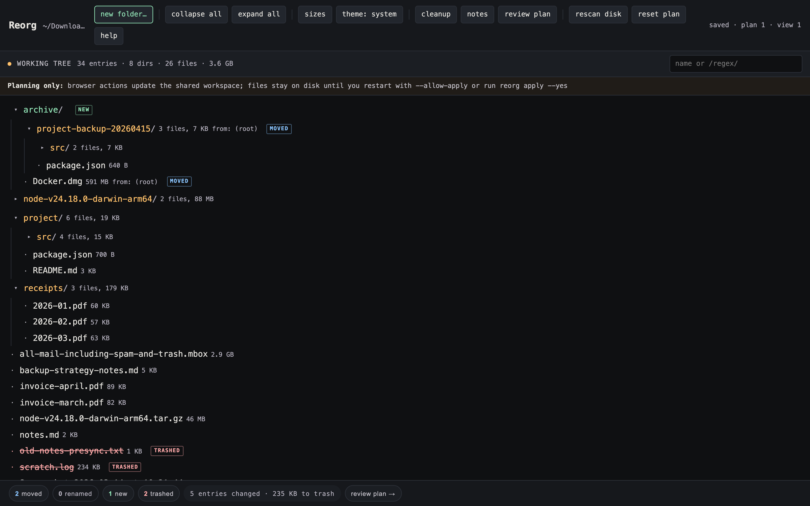
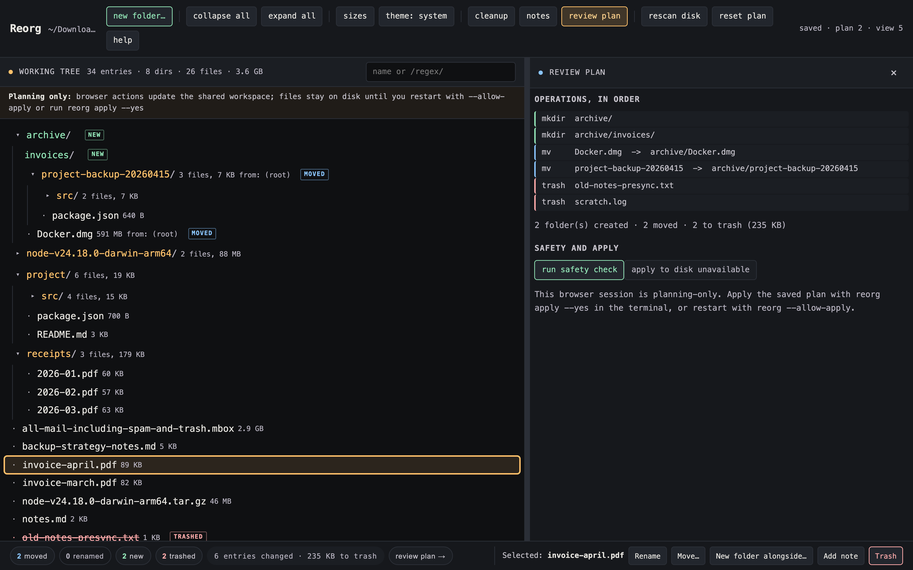
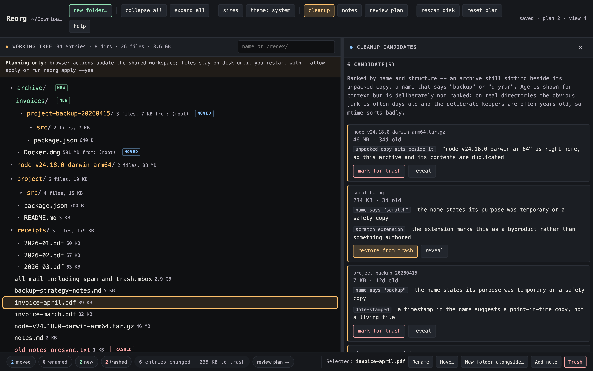

# reorg

Reorganize a messy directory by dragging it into shape, then apply the plan with one command – and an undo script.

```
npx reorg-cli ~/Downloads
```

That scans the directory, opens a planner in your browser, and prints a URL. Drag folders around, rename things, mark junk for trash. Nothing touches disk until you say so.



No runtime dependencies, no build step, no config file. One Node script and a page.

## Why

Cleaning up a directory is two jobs that get tangled together: *deciding* what the shape should be, and *executing* a pile of `mv` commands without breaking anything. Doing both at once in a terminal means you lose the plan halfway through, or you discover the conflict after the third move.

reorg splits them. You do all the deciding in a view where the whole tree is visible and every change is reversible with a keystroke. When the shape looks right, the tool works out the operations – in a correct order, with collisions caught up front – and executes them as one checked batch that it can also undo.

It is useful for a `~/Downloads` that got away from you, a repo whose layout no longer matches how you think about it, or a scratch directory you have been meaning to triage for a year.

## Install

Nothing to install: `npx reorg-cli <dir>` runs it, and installs the command as `reorg`. Or clone and link it:

```bash
git clone https://github.com/j-256/reorg
cd reorg && npm link      # then: reorg <dir>
```

Requires Node 22 or newer – the oldest release still receiving security updates. There are no runtime dependencies: `package.json` has an empty `dependencies` block and that is deliberate.

## Tests

```bash
npm test        # no install needed -- runs on a bare checkout
npm run test:ui # browser tests; needs `npm ci` and a Chromium
npm run test:all
```

`npm test` needs nothing installed, deliberately: it covers the scanner, the plan resolver, the apply engine and its undo scripts, the triage signals, the server's access control, and the browser-side plan model, all under `node --test` with nothing fetched.

`npm run test:ui` drives the real page in a real Chromium, which is the only way to cover what a fake DOM cannot: drop-zone geometry is computed from the pointer's position against a row's box, and jsdom reports every box as zero-sized. It also runs a WCAG AA contrast sweep over both themes. Playwright is the one dependency in the repo and it is confined to `devDependencies`:

```bash
npm ci && npx playwright install chromium
```

## Using it

| Command | What it does |
|---|---|
| `reorg [dir]` | scan, serve the planner, open a browser |
| `reorg plan [dir]` | print the current plan as operations |
| `reorg apply [dir]` | dry run: print what would happen, change nothing |
| `reorg apply [dir] --yes` | apply, writing an undo script first |
| `reorg undo [dir]` | run the most recent undo script |
| `reorg status [dir]` | what is planned, applied, and undoable |
| `reorg summarize [dir]` | one-line AI description per file (see below) |
| `reorg triage [dir]` | rank likely-disposable entries and say why |

In the planner:

- **drag** a row onto a folder's middle to move *into* it; onto the top or bottom edge to become a sibling. Drop below the tree to move to the top level.
- **double-click** or `F2` to rename in place.
- **`Delete`** marks for trash. Folders take their contents with them.
- **`n`** makes a new folder inside the selection; **`N`** attaches a note.
- **`Space`** previews a file (first 100 lines, read on demand).
- **`/`** jumps to the filter box; wrap the query in slashes for a regex (`/\.log$/`).
- **`?`** lists every key.

Toolbar toggles persist in the plan, so the view you set up is the view you come back to: **git** tints rows by git status, **heat** draws a size bar on each row, and **theme** cycles `auto` (follow the system) through forced `dark` and `light`.

Sibling order is *derived* (folders first, then natural sort), never stored. Dragging something out of a folder and back is a genuine no-op rather than a phantom "reordered" change.

## Safety

Applying a reorganization is the part that can ruin your afternoon, so the plan is always shown as the exact operations it resolves to, in order, before anything runs:



- **Dry run is the default.** `reorg apply` prints and exits. Only `--yes` moves anything. The browser cannot apply at all unless you started it with `--allow-apply`.
- **Nothing is deleted.** "Trash" moves into `.reorg/trash/<run>/`. Emptying that is a separate decision you make yourself.
- **Drift aborts the whole batch.** Every source path is checked to still exist and every destination to be free *before* the first move. If the tree changed since the scan, nothing is applied – not "nothing further", nothing at all.
- **An undo script is written before execution starts**, so even a crash mid-run leaves a way back. It is guarded per step, so running it after a partial apply undoes only what happened.
- **Collisions are caught at plan time**, not discovered at move time: two entries landing on one path, a folder marked for trash that still holds things you kept, a folder dragged inside itself.
- **`git mv` for tracked files**, so history follows the move. (Git refuses this on a fully-untracked directory; reorg falls back to a plain rename there.)
- **Rename cycles work.** Swapping two names is impossible with direct renames in any order, so reorg routes cycle members through a staging directory instead of failing.

Your plan lives in `.reorg/plan.json`, which is a diff against the scan rather than a copy of the tree. `.reorg/` git-ignores itself on creation, so planning a repo's layout never dirties that repo.

## File summaries

Half of triage is remembering what a file *is*. `reorg summarize` labels each one with a single line – "nightly S3 sync of /var/data", not "a shell script" – and the planner shows it inline next to the filename.

Two ways to get them, and the default needs no API key:

```bash
# Agent path: writes a prompt pack, your coding agent fills it in. Free.
reorg summarize ~/Downloads          # -> .reorg/summarize.md + summaries.json
#   ...point Claude Code (or any agent) at that markdown file...
reorg summarize --ingest ~/Downloads

# API path: calls the Messages API directly. Needs a key.
ANTHROPIC_API_KEY=sk-... reorg summarize ~/Downloads
```

The API path batches files (about a dozen per request), sends only the first few KB of each, skips binaries and empty files, and defaults to Haiku because this is a classification job. Override with `--model`. It uses `fetch` against the documented HTTP API – no SDK dependency.

Summaries are stored in the plan and keyed by path, so they survive a rescan.

## Triage: what looks disposable

`reorg triage` ranks entries that look like junk and says why, so a directory that has got away from you starts with a shortlist instead of a scroll. The same list is in the planner behind the **triage** button, where each row has a mark-for-trash button.



**It ranks names and structure, not age.** That is the opposite of the obvious design, and it is deliberate: a name is frequently a direct statement of intent – someone wrote "backup" or "dryrun" because that is what the thing was for – where mtime turns out to predict almost nothing. The signals are:

| Signal | Why |
|---|---|
| an archive beside its unpacked copy | pure duplication; one of the two is redundant |
| a name ending in `backup`/`dryrun`/`tmp`/`presync`/... | the name states it was a safety copy |
| installer (`.dmg`, `.pkg`, `.msi`) | re-downloadable, dead weight once installed |
| scratch extension (`.log`, `.bak`, `.crdownload`) | a byproduct, not something authored |
| a bare `.git` clone | a mirror kept as a one-off safety copy |
| bulky | worth a decision purely for what it costs to keep |

Position matters, because the same word can name a subject rather than a status. `work-backup-20260317` is a backup; `backup-strategy-notes.md` is a document about backups, and `all-mail-including-spam-and-trash.mbox` is three gigabytes of actual mail. Only trailing markers count – both of those were real false positives, and flagging 3 GB of someone's mail as trash is how a suggestion list loses its reader.

Emptiness is deliberately not a signal: empty directories are often intentional (mount points, placeholders) and cost nothing to keep.

### Why age is not a signal

The screenshots above are a synthetic directory built by `npm run screenshots`, so everything in them is minutes old. The ranking was tuned against a different sample – one real, long-neglected scratch directory – where mtime and disposability turned out to be close to unrelated:

- The clearly-disposable entries – a `-backup-20260425` directory, a `.zip` still sitting beside its unpacked copy, a downloaded `.dmg` – had ages spanning 12 to 586 days, so age separated them from nothing. Seven of eight `-backup-`/`-dryrun-` directories were all *12 days old*: an age sort would have called them active work.
- What age surfaced at the top instead were keepers – an example image kept on purpose for two years, a reference screenshot, a script still in use.

Age is still shown on every row, for context. It is just never what sorts them.

## How the plan becomes operations

Worth knowing, because it explains why the output looks the way it does.

Every entry has a stable id (its path at scan time) and two positions: the frozen original and the live one you edit. The diff between them is the plan. Resolving it produces operations in dependency order:

1. **`mkdir`** for folders you invented, shallowest first.
2. **`mv`**, but only for entries whose *own* position changed. Moving `a/` to `b/a/` relocates everything inside it implicitly – emitting a second move for `a/x` would fail, because by then its source is gone. Destinations are final-tree paths, so each entry moves once.
3. **`trash`** last, at each entry's post-move location.

Move ordering is a topological sort over two constraints: vacate before occupy (if X lands where Y still is, Y goes first), and parent before child (if X lands inside where Y is going, Y arrives first). A cycle between them means no order works, which is when staging kicks in.

`reorg plan` prints exactly this list, and the planner's **review** panel shows the same thing before you apply.

## Layout

```
bin/reorg          CLI: scan, serve, plan, apply, undo, summarize, status
src/scan.js        walk a directory, tag git status, summarize collapsed dirs
src/plan.js        pure resolver: plan -> ordered operations (no fs, no exec)
src/apply.js       execute, with drift checks, git mv, trash, undo script
src/summarize.js   Messages API batching + the no-key agent prompt pack
src/signals.js     cleanup signals: what looks disposable, and why (name, not age)
src/server.js      stdlib http server, token-gated JSON API
src/state.js       .reorg/plan.json load, save, self-ignore
web/               the planner: tree, drag and drop, preview, review
test/              unit tests for the resolver, integration tests on real temp dirs
```

`src/plan.js` is deliberately pure so the risky decisions are testable without a filesystem. The integration tests do the opposite – real directories, real git repos, real `bash undo-*.sh` round trips – because a resolver that is right on paper and wrong on disk is worthless.

```bash
npm test
```

## The server

`reorg` serves on loopback with a per-run token in the URL. That is not theatre: the API can read file contents and, with `--allow-apply`, move files. A token means another process on the machine, or a stray browser tab, cannot drive it. Path parameters are confined to the scan root, so `../../etc/passwd` is rejected rather than served.

## License

AGPL-3.0-only. See [LICENSE](LICENSE).
